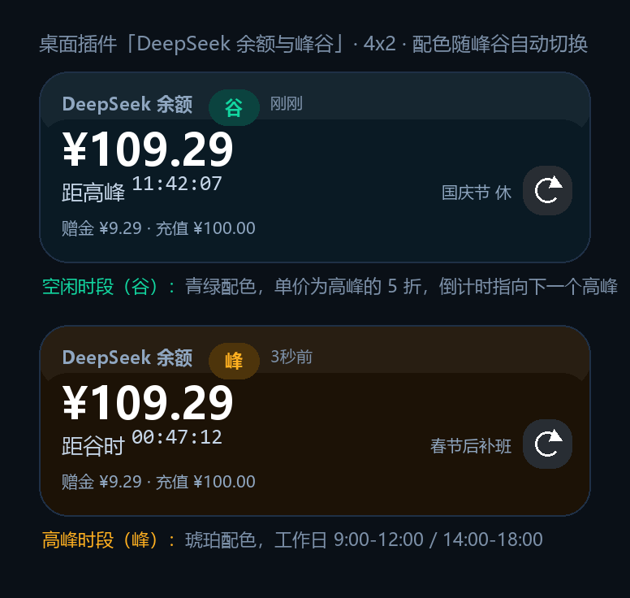

# DeepSeek 余额与峰谷 · 小米桌面插件

一个 Android 桌面小部件：把 **DeepSeek 账户余额** 和 **当前属于高峰还是空闲（谷时）时段** 直接钉在桌面上，
默认 **每 5 秒刷新一次余额**，倒计时每秒跳动到下一次峰谷切换。



> 左侧为谷时状态（青绿），右侧为高峰状态（琥珀）。配色随档位自动切换，一眼就能看出现在贵不贵。

---

## 1. 先说清楚：这个仓库里有什么、没有什么

| | 状态 |
|---|---|
| 完整可编译的 Android 工程源码 | ✅ 已包含 |
| 峰谷判定逻辑的单元测试（JUnit）| ✅ 已包含 |
| 一键出 APK 的 GitHub Actions 工作流 | ✅ 已包含 |
| **编译好的 APK** | ❌ 没有 |

**为什么没有 APK**：生成 APK 需要 JDK + Android SDK + Gradle，本机没有安装任何一项
（`java`、`gradle`、`ANDROID_HOME` 全部为空，C 盘可用空间也不足以下载 SDK）。
所以 APK 需要你用下面两种方式之一自己出，**任选一种即可，都不需要在这台机器上装环境**：

- **方式 A（最省事）**：把这套代码推到 GitHub，Actions 自动编译并给出 APK 下载链接；
- **方式 B（最直接）**：用 Android Studio 打开本目录，点一下 Run/Build。

---

## 2. 功能清单

- **桌面插件（4x2，可缩放）**：大字余额 + 峰/谷徽章 + 距下次切换的倒计时 + 赠金/充值明细
- **默认 5 秒刷新余额**，可在 5/10/15/30/60/120/300 秒之间调整
- **倒计时每秒跳动**（可关闭省电），精确到「距高峰 / 距谷时 hh:mm:ss」
- **法定节假日感知**：节假日全天算谷时；**调休补班的周末**照常有峰谷之分
- **三重刷新链路**：前台服务（秒级）→ 系统 `updatePeriodMillis`（30 分钟）→ WorkManager 周期任务（15 分钟）
- **一键兜底动作**：插件上的 ↻ 按钮立即刷新；点峰/谷徽章在「自动 / 强制峰 / 强制谷」之间切换
- **常驻通知**：收起时显示「谷 · ¥109.29 · 刚刚」，展开有完整时段说明
- **息屏省电**：默认息屏暂停请求、亮屏立刻补一次（可改成息屏也刷新）
- **小米专用引导**：直接跳到「电池优化白名单」「应用设置」「通知权限」
- **不联网也能用**：内置 2025–2026 法定节假日日历，联网后自动更新

---

## 3. 出 APK 的两种方式

### 方式 A：GitHub Actions 云端编译（无需本地环境）

```bash
cd DeepSeekBalanceWidget
git init
git add .
git commit -m "DeepSeek 余额桌面插件"
git branch -M main
git remote add origin https://github.com/<你的用户名>/<仓库名>.git
git push -u origin main
```

推送后：

1. 打开仓库页面 → **Actions** 标签 → 选择左侧 **Build APK**；
2. 如果没自动跑，点 **Run workflow** 手动触发；
3. 等 3–6 分钟跑完，进入这次运行记录，页面底部 **Artifacts** 里下载
   `deepseek-balance-widget-apk`，解压得到：
   - `app-debug.apk` —— 调试版，**推荐先用这个**，可直接安装；
   - `app-release.apk` —— 用 debug 签名打的 release 包，体积更小，同样可直接安装。

也可以打 tag 自动发 Release：

```bash
git tag v1.0.0 && git push origin v1.0.0
```

工作流会顺带跑单元测试，测试挂了就不会出包（这一步能帮你挡住峰谷判定被改错的情况）。

### 方式 B：Android Studio 本地编译

1. 下载安装 [Android Studio](https://developer.android.com/studio)（自带 JDK 17 和 Android SDK，**不需要**单独装 Java）；
2. 首次启动让它自动下载 SDK，`compileSdk` 用到的是 **API 35**；
3. `File → Open`，选择本项目根目录 `DeepSeekBalanceWidget`，等待 Gradle 同步完成；
   - 已配置**阿里云镜像优先**（`settings.gradle.kts`），国内网络一般 1–3 分钟同步完；
   - 如果同步仍有问题，确认已装 Android SDK 35 与 Build-Tools 35。
4. 连接手机（需开启「USB 调试」）后点绿色 ▶；或 `Build → Build Bundle(s)/APK(s) → Build APK(s)`，
   产物在 `app/build/outputs/apk/debug/app-debug.apk`。

命令行编译（需自己装 JDK 17 + Gradle 8.9+）：

```bash
gradle :app:testDebugUnitTest    # 跑峰谷判定单测
gradle :app:assembleDebug        # 出调试包
```

---

## 4. 安装与首次配置

1. 把 APK 传到手机安装（小米会提示「未知来源应用」，允许本次安装即可）；
2. 打开 App，粘贴 DeepSeek API Key（在 [platform.deepseek.com](https://platform.deepseek.com) → **API keys** 创建），
   点 **保存并启动**；
3. 按提示完成小米保活设置（见第 6 节，**这步不做的话刷新会被系统冻结**）；
4. 回到桌面，**长按空白处 → 添加小部件 / 桌面工具 → 找到「DeepSeek 余额与峰谷」** → 拖到桌面；
5. 如果是从桌面添加的插件，系统会先跳到配置页，点 **完成，放到桌面**。

> API Key 只保存在 App 私有目录的 SharedPreferences 里，插件只访问 `api.deepseek.com` 的
> `/user/balance` 接口，不做任何上报。Android 备份已关闭（`data_extraction_rules.xml`）。

---

## 5. 峰谷规则（实现依据）

来自 DeepSeek 官方定价页 [模型 & 价格](https://api-docs.deepseek.com/zh-cn/quick_start/pricing)：

> 空闲时段价格为高峰时段价格的一半。**北京时间周一至周五（不含中国法定节假日）9:00 - 12:00、14:00 - 18:00 为高峰时段；
> 其余时段，包括周末及中国法定节假日全天均为空闲时段。**

因此本项目按下列顺序判定（全部用 **北京时间 `Asia/Shanghai`**，与手机时区无关）：

| 日子类型 | 判定 |
|---|---|
| 法定节假日（含春节/国庆等）| 全天 **谷** |
| 周六 / 周日（未调休补班）| 全天 **谷** |
| 调休补班日（周末上班）| 有峰谷之分，按工作日规则 |
| 工作日 09:00–12:00、14:00–18:00 | **峰** |
| 工作日其余时间（含 12:00–14:00 午休）| **谷** |

边界包含关系：`09:00`、`12:00`、`14:00`、`18:00` 这四个整点算在**前一个区间**内
（与官方表的区间写法一致），`12:01` 起为午间谷、`18:01` 起为谷。

节假日日历来自公开接口 `timor.tech/api/holiday/year`，内置了 2025–2026 全部特殊日期（72 条），
App 内可手动更新，服务启动时每 24 小时最多自动更新一次。

---

## 6. 小米 / 红米（MIUI / HyperOS）必做设置

MIUI 对后台的限制比原生 Android 严格得多，**不做这几步，5 秒刷新会被冻结**：

1. **省电策略 → 无限制**：设置 → 应用设置 → 应用管理 → 本应用 → 省电策略 → 无限制
   （App 内「电池优化」按钮可直接跳到系统弹窗，允许「忽略电池优化」）
2. **允许自启动**：设置 → 应用设置 → 本应用 → 自启动 → 打开
3. **最近任务加锁**：打开最近任务，长按本应用卡片 → 点锁图标，避免被「一键清理」清掉
4. **允许通知**：前台服务必须有常驻通知，Android 13+ 要在弹出的权限框里点允许
   （App 内「通知权限」按钮可手动触发）
5. 可选：设置 → 通知 → 本应用 → 允许「锁屏通知」，方便不亮屏也能瞄一眼余额

即使这些都被系统重置了，WorkManager 的 15 分钟兜底任务和插件的 30 分钟系统刷新也会让数字继续更新，
只是不再是 5 秒级别。

---

## 7. 工程结构与关键实现

```
DeepSeekBalanceWidget/
├─ .github/workflows/build-apk.yml        # 云端出 APK
├─ app/src/main/
│  ├─ AndroidManifest.xml                 # 权限、插件 provider、前台服务、开机广播
│  ├─ assets/holidays.json                # 内置法定节假日日历（2025–2026）
│  ├─ java/com/deepseek/balancewidget/
│  │  ├─ MainActivity.kt                  # 唯一界面（Compose）+ 插件配置页
│  │  ├─ core/
│  │  │  ├─ PeakScheduler.kt              # ★ 峰谷判定核心：档位、下一次切换、倒计时格式化
│  │  │  ├─ HolidayCalendar.kt            # 节假日日历（内置资产 + 联网更新 + 落盘）
│  │  │  ├─ TariffTier.kt                 # 峰 / 谷 枚举与文案
│  │  │  ├─ WidgetState.kt                # 插件要展示的全部状态
│  │  │  ├─ WidgetStateBus.kt             # 进程内状态总线（服务写，界面/插件读）
│  │  │  └─ DateUtil.kt                   # 一律用北京时间
│  │  ├─ data/
│  │  │  ├─ DeepSeekApi.kt                # /user/balance 响应解析（纯函数，可单测）
│  │  │  ├─ BalanceRepository.kt          # OkHttp 请求 + 错误映射（401/402/429/网络）
│  │  │  ├─ AppSettings.kt                # 设置项（StateFlow）
│  │  │  ├─ BalanceStore.kt               # 余额快照缓存（进程被杀也不掉数字）
│  │  │  └─ HolidayUpdater.kt             # 节假日联网更新
│  │  ├─ service/
│  │  │  ├─ BalanceService.kt             # ★ 前台服务：1s 走倒计时 / 5s 查余额 / 指数退避
│  │  │  ├─ ServiceController.kt          # 拉起与存活校验
│  │  │  └─ Notifier.kt                   # 常驻通知（第二块屏）
│  │  ├─ widget/
│  │  │  ├─ BalanceWidgetProvider.kt      # AppWidgetProvider
│  │  │  ├─ WidgetRenderer.kt             # ★ RemoteViews 渲染与动态配色
│  │  │  ├─ WidgetActionReceiver.kt       # ↻ 刷新 / 峰谷徽章切换
│  │  │  └─ BootReceiver.kt               # 开机恢复
│  │  └─ worker/
│  │     ├─ BalanceRefreshWorker.kt       # 兜底刷新任务
│  │     └─ WidgetWorkScheduler.kt        # 周期 + 立即任务调度
│  ├─ res/layout/widget_balance.xml       # ★ 插件布局（只用 RemoteViews 支持的控件）
│  └─ res/xml/widget_balance_info.xml     # 插件元数据（4x2、可缩放、配置页）
├─ app/src/test/...                       # 单元测试：峰谷判定 + 余额解析
└─ docs/
   ├─ widget-preview.png                  # 预览图
   ├─ make_preview.py                     # 预览图生成脚本
   └─ verify_peak_logic.py                # 峰谷逻辑独立验证（全年逐分钟扫描）
```

### 刷新节奏怎么做到「5 秒」又不太耗电

Android 的桌面插件本身最快只能半小时刷新一次，5 秒级别必须靠前台服务。本项目的做法：

| 内容 | 频率 | 说明 |
|---|---|---|
| 峰谷倒计时重画 | 1 秒 | **纯内存计算**，不发网络请求；关掉「每秒跳动」后改为按刷新间隔重画 |
| `/user/balance` 查询 | 默认 5 秒 | 余额接口不计费、不消耗 token，可安全高频查询 |
| 息屏期间 | 暂停（默认）| 亮屏立刻补一次；想要息屏也刷可在设置里打开 |
| 失败重试 | 1s 起步，指数退避至 60s | 避免网络异常时把接口打爆 |
| 系统兜底 | 15 / 30 分钟 | WorkManager + `updatePeriodMillis`，服务被杀也能续上 |

另外做了「渲染指纹」：倒计时文本没变化时不会向系统推送 RemoteViews，减少 IPC 与唤醒。

### 已做的正确性验证

- `app/src/test/.../PeakSchedulerTest.kt`：22 个用例，覆盖工作日/午间谷/周末/节假日/调休补班/跨周末切换/边界前后一致性/倒计时格式；
- `app/src/test/.../DeepSeekApiTest.kt`：9 个用例，覆盖官方示例响应、多币种、余额为零、鉴权失败、非法 JSON、Key 粗校验；
- `docs/verify_peak_logic.py`：用 Python 独立复刻同一套算法，对 2026 全年 **525,600 个时刻逐分钟扫描**，
  校验「切换时刻只落在 09:00/12:00/14:00/18:00」「切换前后档位必然相反」「倒计时恒为正且不超过 10 天」。
  运行：`python docs/verify_peak_logic.py`

---

## 8. 常见问题

**Q：插件显示 `--` 或一直「尚未同步」？**
A：① 检查 API Key 是否填对；② 打开 App 点「立即刷新」看具体报错；③ 确认已允许通知权限（前台服务需要）。

**Q：余额不刷新了，数字卡住？**
A：大概率被 MIUI 冻结了，按第 6 节做保活设置；然后打开 App 一次即可恢复秒级刷新。

**Q：401 鉴权失败？**
A：Key 被删除或复制错了（注意首尾空格）。重新在开放平台创建并粘贴。

**Q：会额外扣费吗？**
A：不会。`/user/balance` 只是查询接口，不计费也不消耗 token；只有调模型才扣费。

**Q：时段判定和实际扣费差一分钟？**
A：以官方服务器时间为准。手机时间不准时，可在 App 里用「强制高峰 / 强制谷时」手动覆盖显示。

**Q：能不能同时加好几个插件？**
A：可以。多个实例共享同一份数据，删掉最后一个实例时服务会自动停止。

**Q：想上架应用商店？**
A：需要把 `app/build.gradle.kts` 里 release 的签名换成你自己的 keystore（现在用的是 debug 签名，
只是为了让你能直接安装）。另外 `specialUse` 前台服务类型需要向商店说明用途。

---

## 9. 依赖与版本

| 组件 | 版本 |
|---|---|
| Android Gradle Plugin | 8.7.3 |
| Gradle | 8.9 |
| Kotlin | 2.0.21（含 Compose 编译器插件）|
| compileSdk / targetSdk / minSdk | 35 / 35 / **26**（Android 8.0 起，覆盖小米 8 及以上绝大多数机型）|
| Jetpack Compose BOM | 2024.10.01 |
| OkHttp | 4.12.0 |
| WorkManager | 2.9.1 |

仓库已在 `settings.gradle.kts` 中配置阿里云镜像优先、官方源兜底，国内网络可直接同步。

---

## 10. 免责声明

本项目为个人自用工具，与 DeepSeek 官方无关；「高峰/空闲时段」的判定依据官方公开文档实现，
若官方调整计费规则或节假日安排，请以官方页面为准，并在 App 内点「更新节假日数据」。
